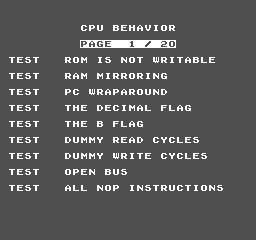
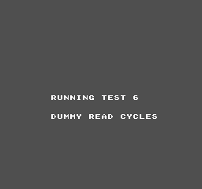
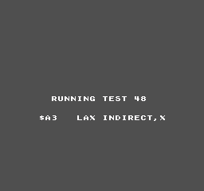

# Real-ROM validation: AccuracyCoin

`test_roms/AccuracyCoin.nes` (mapper 0 / NROM, 32KB PRG, 8KB CHR, horizontal
mirroring) is a modern NES accuracy-test ROM. It is the strongest end-to-end
validation this project has, because it exercises CPU, PPU rendering, and
controller input together on real hardware-targeting code — not synthetic
scenarios we wrote ourselves.

All results below were produced by running the **actual generated Scratch block
graph** through `code/interp.py` and rendering the framebuffer to PNG
(`code/dump_frames.py`, `code/run_accuracycoin.py`). Roughly 7–8 s per frame in
the Python walker.

## 1. It boots and renders correctly

By frame ~90 the ROM draws its menu, and it is **pixel-legible**:



```
       CPU BEHAVIOR
      PAGE  1 / 20
TEST   ROM IS NOT WRITABLE        TEST   DUMMY READ CYCLES
TEST   RAM MIRRORING              TEST   DUMMY WRITE CYCLES
TEST   PC WRAPAROUND              TEST   OPEN BUS
TEST   THE DECIMAL FLAG           TEST   ALL NOP INSTRUCTIONS
TEST   THE B FLAG
```

Correct glyphs, correct positions, correct palette. This validates nametable
fetch, pattern-table decode, attribute/palette resolution, and the framebuffer
pipeline against real ROM output.

## 2. Controller input works end-to-end

`code/run_accuracycoin.py` presses **Start** (key `s`) via `interp.keys`, which
is what the harness's `sensing_keypressed` actually reads — so this drives the
real `ctrl_poll` → `$4016` path, not a bypass. The ROM responded and began
executing its suite:



```
RUNNING TEST 6
DUMMY READ CYCLES
```

This is the first confirmation that the input chain (keyboard → `ctrl_poll` →
controller shift register → `$4016` reads → game logic) works on a real ROM.

## 3. It runs the suite without hanging — but hits our illegal-opcode gap

The ROM advanced steadily: test 6 by frame ~60, test 24 by frame 100, test 48
by frame 150, with no hang, crash, or stall.

However, from roughly test ~10 onward AccuracyCoin is testing **undocumented
(illegal) 6502 opcodes**, which this emulator deliberately does not implement
(undefined opcode bytes execute as NOP — a documented v1 limitation):

| Frame | Test |
|---|---|
| 100 | `$27  RLA ZEROPAGE` |
| 150 | `$A3  LAX INDIRECT,X` |



**Honest reading of this result:** reaching test 48 proves the emulator executes
a long, demanding real-ROM code path without breaking. It does **not** prove
those 48 tests *passed* — the ROM displays "RUNNING TEST n" as it goes and this
run did not reach a results/tally screen, so no pass/fail verdict was captured.
Any test of an illegal opcode is expected to fail against this build.

## What this argues for next

Implementing the undocumented opcodes is now the highest-value CPU work:

- `LAX`, `SAX`, `SLO`, `RLA`, `SRE`, `RRA`, `DCP`, `ISC` are all just
  combinations of operations the CPU already implements (e.g. `RLA` = `ROL`
  then `AND`; `LAX` = `LDA` + `LDX`), so they are cheap to add on top of the
  existing addressing-mode machinery.
- The unstable/analog ones (`XAA`, `AHX`, `TAS`, `SHX`, `SHY`, `LAS`, `ARR`)
  are genuinely hardware-dependent and should be implemented to the commonly
  agreed behaviour, or explicitly documented as out of scope.
- Beyond test scores, some commercial games do use illegal opcodes, so this
  affects real compatibility, not just benchmarks.

## Reproducing

```bash
python code/run_accuracycoin.py 45 8 150 s
```

Arguments: press-at-frame, hold-frames, total-frames, key. PNGs land in
`progress/framedumps_acc_run/` (gitignored; a few representative frames are
copied into `docs/images/`).
